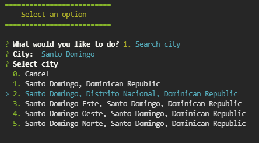

# Weather app

This is my third app with Node.js. With this app you are able to look for any city and get its weather thanks to <a href="https://docs.mapbox.com/api/search/geocoding/">Mapbox Geocoding API</a> and <a href="https://openweathermap.org/">OpenWeather API</a>. For this project I used <a href="https://www.npmjs.com/package/colors">Colors.js</a>, <a href="https://www.npmjs.com/package/inquirer">Inquirer</a>, <a href="https://www.npmjs.com/package/axios">Axios</a> and <a href="</a>">dotenv</a>.

## Usage

After downloading or cloning this repository, make sure to run `npm install` to reconstruct the <strong>node_modules folder</strong>. 

You also have to be registered at Mapbox and OpenWeather to have your own Api keys and use their APIS. Create a .env file and save there both of your API keys just as the example.env file that is on the repository's root, or you can look at the following example:


Then, to start using the app run the next command in your terminal:

```
npm start
```

It will appear the following menu:


Use arrow keys or the options's number to move though them, then select what you'd like to do by pressing ENTER.

## Options

1. Search city: After you select this option, make sure to type the name of the city you want to get the weather from.



The app will show you up to 5 options for the cities that matches what you typed. select the one you think that matches the most with the city you want to get the weather from and then press ENTER. Then, you'll be able to see the weather of the city you searched and some more data.


2. History: Here you'll able to see the last 6 cities you looked for.


0. Exit: Closes the app.